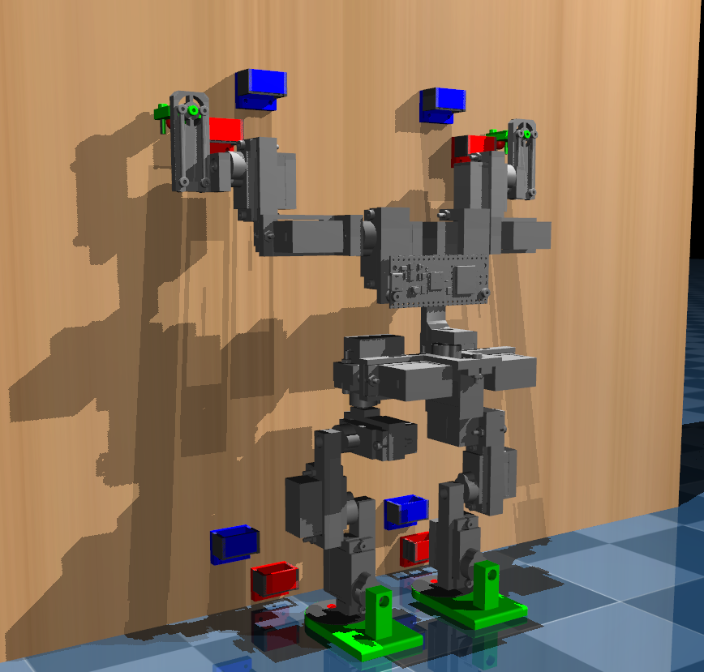
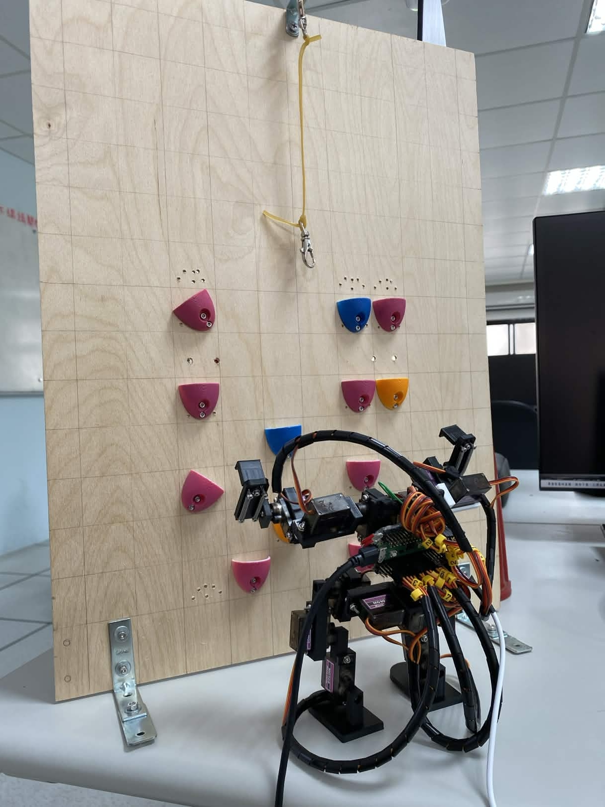

# Little-Climbing-Robot

## Overview
This project develops a small climbing robot using MuJoCo simulation.

The robot can perform basic movements and is designed for future climbing tasks.

---

## Simulation Preview

---

## Demo
- Simulation of Climbing: https://www.youtube.com/watch?v=B-bFdJrVVb0  
- Real Robot Climbing: https://www.youtube.com/shorts/NEtwmXHOAig

---
