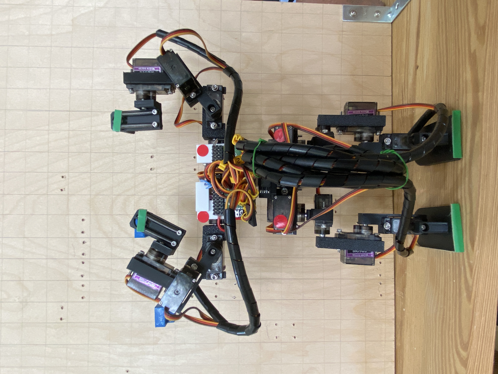
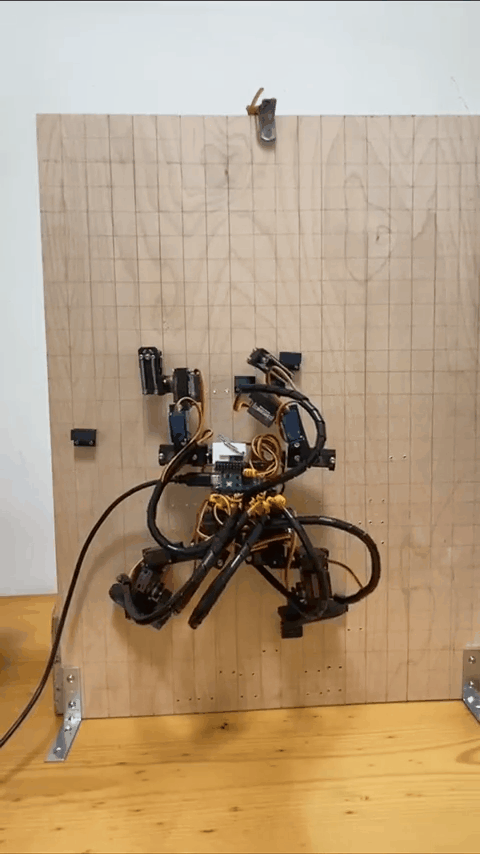
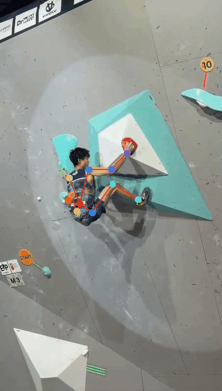
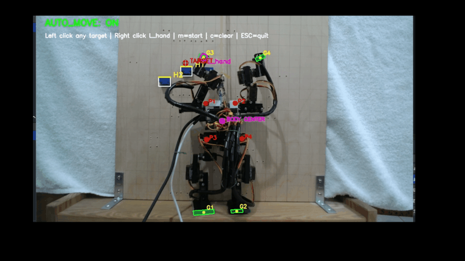

# Little Robot in MuJoCo

  

  

## Overview

This project aims to develop a compact humanoid robot capable of performing complex locomotion tasks such as climbing, walking, and jumping.

The robot uses computer vision and visual servoing to detect colored climbing holds and autonomously control its climbing motions.

---

## Demonstrations

### Real Robot Climbing

  

### Body Frame Detection

  

### Visual Servoing

  

